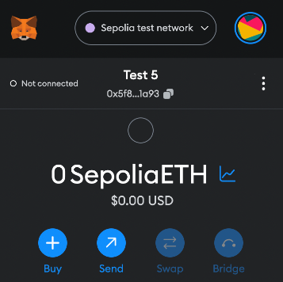

# INFURA - Onboarding Guide


- [INFURA - Onboarding Guide](#infura---onboarding-guide)
  - [Prerequisites](#prerequisites)
  - [Switch Network](#switch-network)
  - [Top up Sepolia tokens to the wallet](#top-up-sepolia-tokens-to-the-wallet)
  - [🎮 Playground](#-playground)
    - [Set up development environment](#set-up-development-environment)
    - [Creat a smart contract](#creat-a-smart-contract)
    - [📦 Deploy the smart contract to Sepolia](#-deploy-the-smart-contract-to-sepolia)


## Prerequisites

* [Download and Set up MetaMask] (https://metamask.io/download/)
* [Signup from Infura] (https://app.infura.io/dashboard)

## Switch Network

Once your wallet is set up, navigate to the top-right of the wallet window and click on Show/Hide Test Networks. After showing test networks, you’ll see the drop-down option for Sepolia. Switch your network from Ethereum mainnet to Sepolia test network.



## Top up Sepolia tokens to the wallet

We can obtain Sepolia tokens for free through the [Infura Sepolia faucet](https://www.infura.io/faucet/sepolia).  


## 🎮 Playground

### Set up development environment

Create node.js project
```shell
mkdir infura-project && cd infura-project
npm init -y
```

install Truffle
```shell
npm -g install truffle
```

install hdwallet-provider and dotenv
```shell
npm install @truffle/hdwallet-provider dotenv
```

Create .env file
```shell
mv .env.sample .env
```
Supplement inforamtion
* ``INFURA_API_KEY`` as the API key from infura
* ``MNEMONIC`` as the mnemonic from metamask wallet or the private key from metamask wallet
```shell
INFURA_ENDPOINT = "https://sepolia.infura.io/v3/{{INFURA_API_KEY}}"
MNEMONIC = "{{METAMASK_MNEMONIC or METAMASK_PRIVATE_KEY}}"
```

### Creat a smart contract 

1. Init a truffle project
```shell
npx truffle init
```

2. Create a smart contract and placed in ``./contracts`` folder

### 📦 Deploy the smart contract to Sepolia
1. Create truffle.config.js to configuate with the env information 
```
require('dotenv').config();
const HDWalletProvider = require('@truffle/hdwallet-provider');
const { INFURA_ENDPOINT, MNEMONIC } = process.env;

module.exports = {
  networks: {
    development: {
      host: "127.0.0.1",
      port: 8545,
      network_id: "*"
    },
    sepolia: {
      provider: () => new HDWalletProvider(MNEMONIC, INFURA_ENDPOINT),
      network_id: '11155111',
    },
  },
  compilers: {
    solc: {
      version: "0.8.20",
    }
  }
};
```
2. Create deployment script in ``./migrations`` , please refer to ``./migrations/1_deploy_contract.js``

3. Deploy the contract
```shell
npx truffle migrate --network sepolia
```

If all goes well, you should see output that looks something like this:

```shell
Compiling your contracts...
===========================
> Everything is up to date, there is nothing to compile.


Migrations dry-run (simulation)
===============================
> Network name:    'sepolia-fork'
> Network id:      11155111
> Block gas limit: 30000000 (0x1c9c380)

…

Starting migrations...
======================
> Network name:    'sepolia'
> Network id:      11155111
> Block gas limit: 30000000 (0x1c9c380)


1_deploy_contract.js
====================

   Deploying 'Donations'
   ---------------------
   > transaction hash:    0xab4650f9fb25379fcb7d95e18c42f3235069566da2cb75d5f654e7b9a5100f3b
   > Blocks: 0            Seconds: 20
   > contract address:    0xb658FB9c330381a059e8A14363F71fb7D4648f2A
   > block number:        3558024
   > block timestamp:     1685040444
   > account:             0x147A4cb54D7181222B7E10a91A492d5b4892b4aC
   > balance:             0.499121902496838849
   > gas used:            351239 (0x55c07)
   > gas price:           2.500000009 gwei
   > value sent:          0 ETH
   > total cost:          0.000878097503161151 ETH

Donations contract deployed at: 0xb658FB9c330381a059e8A14363F71fb7D4648f2A
   > Saving artifacts
   -------------------------------------
   > Total cost:     0.000878097503161151 ETH

Summary
=======
> Total deployments:   1
> Final cost:          0.000878097503161151 ETH

```

Congratulations! Your contract is now live! You can double-check this by searching for your contract address on Sepolia Etherscan.
